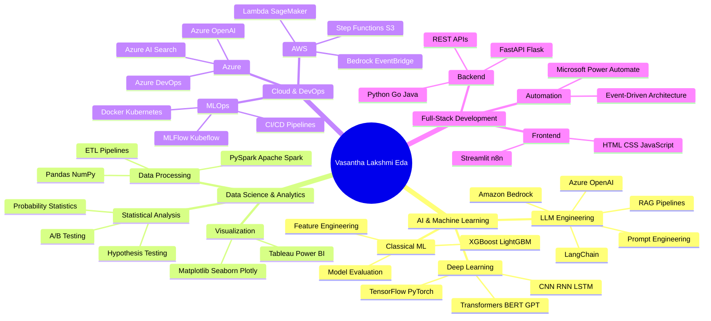
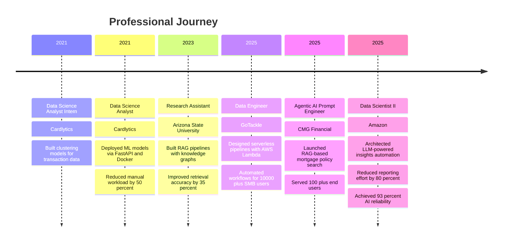

<!-- 
██╗   ██╗ █████╗ ███████╗ █████╗ ███╗   ██╗████████╗██╗  ██╗ █████╗     ██╗      █████╗ ██╗  ██╗███████╗██╗  ██╗███████╗██╗
██║   ██║██╔══██╗██╔════╝██╔══██╗████╗  ██║╚══██╔══╝██║  ██║██╔══██╗    ██║     ██╔══██╗██║ ██╔╝██╔════╝██║  ██║██╔════╝██║
██║   ██║███████║███████╗███████║██╔██╗ ██║   ██║   ███████║███████║    ██║     ███████║█████╔╝ ███████╗███████║███████╗██║
╚██╗ ██╔╝██╔══██║╚════██║██╔══██║██║╚██╗██║   ██║   ██╔══██║██╔══██║    ██║     ██╔══██║██╔═██╗ ╚════██║██╔══██║╚════██║██║
 ╚████╔╝ ██║  ██║███████║██║  ██║██║ ╚████║   ██║   ██║  ██║██║  ██║    ███████╗██║  ██║██║  ██╗███████║██║  ██║███████║██║
  ╚═══╝  ╚═╝  ╚═╝╚══════╝╚═╝  ╚═╝╚═╝  ╚═══╝   ╚═╝   ╚═╝  ╚═╝╚═╝  ╚═╝    ╚══════╝╚═╝  ╚═╝╚═╝  ╚═╝╚══════╝╚═╝  ╚═╝╚══════╝╚═╝
-->

<div align="center">

</div>

<div align="center">

```bash
┌─[vasantha@terminal]─[~/professional_identity]
└──╼ $ whoami
Vasantha Lakshmi Eda • Full-Stack AI/ML Professional • Data Scientist II @ Amazon

┌─[vasantha@terminal]─[~/career_stats]
└──╼ $ ls -la achievements/
drwxr-xr-x  5+ years of experience in AI/ML & Data Science
drwxr-xr-x  15+ enterprise projects delivered (Amazon, CMG Financial, GoTackle, Cardlytics)
-rw-r--r--  80% reduction in manual reporting effort (Amazon LLM automation)
-rw-r--r--  93% AI output reliability across inference pipelines
-rw-r--r--  60% reduction in customer survey analysis time
-rw-r--r--  35% improvement in information retrieval accuracy (RAG pipelines)
-rw-r--r--  40% reduction in manual data review (NLP automation)
-rw-r--r--  25+ technologies mastered (Python, AWS, Azure, LLMs, MLOps)
```

</div>

<table align="center">
<tr>
<td></td>
<td></td>
<td></td>
</tr>
</table>

<div align="center">

[](http://www.linkedin.com/in/lakshmive)
[](https://github.com/vasanthaEda)
[](https://vasanthaeda.github.io)


</div>

---

## 🚀 Professional Identity



<table width="100%">
<tr>
<td width="50%" valign="top">

### 💻 Core Expertise

```typescript
class DataScientist implements AIExpert {
  private expertise: TechStack = {
    languages: [
      "Python", "SQL", "R", "Go", 
      "Java", "Bash", "JavaScript"
    ],
    aiFrameworks: [
      "TensorFlow", "PyTorch", "Keras",
      "Hugging Face Transformers",
      "LangChain", "LangGraph"
    ],
    llmTools: [
      "Amazon Bedrock", "Azure OpenAI",
      "RAG Pipelines", "Prompt Engineering",
      "BERT Score", "Hallucination Mitigation"
    ],
    cloudPlatforms: [
      "AWS", "Azure", "GCP"
    ],
    specializations: [
      "LLM-Powered Automation",
      "RAG Systems", "MLOps",
      "Real-Time Data Pipelines"
    ]
  };
}
```

</td>
<td width="50%" valign="top">

### 📊 Impact Metrics

```python
achievement_matrix = {
    'experience_years': 5,
    'projects_delivered': 15,
    'manual_effort_reduction': '80%',
    'ai_reliability_score': '93%',
    'data_processing_speedup': '4x',
    'retrieval_accuracy_boost': '35%',
    'automation_time_saved': '60%',
    'operational_risk_reduction': '25%',
    'data_quality_improvement': '30%',
    'companies_served': [
        'Amazon', 'CMG Financial',
        'GoTackle', 'Cardlytics', 'ASU'
    ],
    'technologies_mastered': 25,
    'education': 'MS Information Technology (4.0 GPA)'
}
```

</td>
</tr>
</table>

---

## 🎯 About Me

I am a **Full-Stack AI/ML Professional** with over **5 years of experience** transforming raw data into intelligent, production-ready systems that drive business value. Currently serving as a **Data Scientist II at Amazon**, I architect end-to-end LLM-powered automation pipelines that reduce manual effort by **80%** while maintaining **93% reliability** across all inference runs.

My expertise spans the entire AI/ML lifecycle: from designing **RAG pipelines** with **LangChain** and **Amazon Bedrock** to orchestrating scalable data workflows with **AWS Step Functions**, **SageMaker**, and **Apache Spark**. I've deployed **AI-driven insights systems** serving **20+ MBR metrics** to targeted personas, built **agentic AI solutions** handling **100+ end users**, and engineered **real-time ETL pipelines** processing millions of records with **15% performance improvements**.

What sets me apart is my ability to bridge the gap between cutting-edge AI research and production-grade systems. I don't just build models—I build **reliable, monitored, and scalable AI systems** that integrate seamlessly into enterprise workflows. Whether it's implementing **BERT-based evaluation frameworks**, designing **event-driven architectures** with **Lambda** and **DynamoDB**, or fine-tuning **pre-trained transformers** on custom datasets, I deliver solutions that are both technically sophisticated and business-focused.

My academic foundation—a **Master's degree in Information Technology from Arizona State University (4.0 GPA)** and a **Bachelor's in Information Technology (8.3/10)**—combined with hands-on experience at **Amazon**, **CMG Financial**, **GoTackle**, and **Cardlytics**, has equipped me with a unique blend of theoretical depth and practical execution skills. I've won the **Smart India Hackathon 2021** for building an AI-driven NLP solution under real-world constraints, demonstrating my ability to deliver under pressure.

I thrive in environments where I can leverage **LLMs**, **RAG systems**, **MLOps**, and **cloud-native architectures** to solve complex problems. My work is characterized by a relentless focus on **impact**: every pipeline I build, every model I deploy, and every automation I architect is designed to deliver measurable business outcomes—whether that's reducing operational costs, improving decision-making speed, or enhancing user satisfaction.

---

## 💼 Professional Experience



<table width="100%">
<tr>
<td width="50%" valign="top">

### 🚀 Amazon — Data Scientist II
**`Oct 2025 – Apr 2026 • Seattle, WA (Remote)`**

  

- **Architected** an end-to-end **LLM-Powered Insights Automation System** delivering monthly, weekly, and daily issue lifecycle reports, **reducing manual reporting effort by ~80%** and enabling faster, data-driven decisions across teams
- **Designed and orchestrated** scalable data pipelines using a **dual-package architecture** (CDK-based infrastructure for DAGs, S3, IAM, monitoring + Python science package), improving pipeline reliability and reducing failures
- **Orchestrated** the end-to-end inference pipeline via **AWS Step Functions** state machine sequencing data availability checks (Lambda), **SageMaker Processing Jobs** (data validation, transformation, top-contributor generation, Bedrock LLM inference, evaluation, and S3 writes) using SQL and modular Python packages
- **Developed** AI-driven, persona-based actionable recommendations for builders, tool teams, and leadership by passing a rich knowledge base (business context, domain knowledge, and issue metadata) into **Amazon Bedrock (Claude)**, improving decision consistency and operational efficiency
- **Implemented** evaluation frameworks including ground-truth alignment (**BERT-based similarity**), field completeness, and data quality checks, achieving **93% AI output reliability** across all inference runs
- **Deployed** a **Slack bot** that automatically delivers reports for **20+ MBR metrics** to targeted personas, improving visibility, reducing follow-ups, and streamlining communication
- **Automated** an end-to-end customer survey analysis pipeline for **7+ tools** using Python, **NLTK**, and **spaCy**, handling tool-specific survey variations, data ingestion, cleaning, transformation, NLP-based sentiment analysis, and reason-grouping on customer comments to generate structured CSAT insights, **reducing manual effort by ~60%**
- **Delivered** structured CSAT insights to product managers and leadership via **Amazon Quick Suite dashboards** including trend visualizations (line and donut charts), reason groups, likes/dislikes, and satisfaction scores across tools, accelerating product roadmap prioritization

**Technologies:** Python • AWS Lambda • SageMaker • Bedrock • Step Functions • S3 • CDK • SQL • BERT • NLTK • spaCy • Slack API • Amazon Quick Suite

</td>
<td width="50%" valign="top">

### 🏦 CMG Financial — Agentic AI Prompt Engineer
**`July 2025 – Oct 2025 • San Ramon, CA (Hybrid)`**

  

- **Engineered** a **RAG-based mortgage policy search system** using **LangChain**, **Azure OpenAI**, and **Azure AI Search**, indexing **40+ policy documents** to enable loan officers and customers to query guidelines via natural language, improving decision consistency and reducing manual policy lookup time
- **Launched** an **AIO paydown simulator** as a chat interface using Python, RAG, and **n8n**, serving **100+ end users** to model and analyze loan repayment scenarios conversationally, reducing dependency on manual financial calculations
- **Independently delivered** an **AI-powered meeting transcript automation system** using an event-